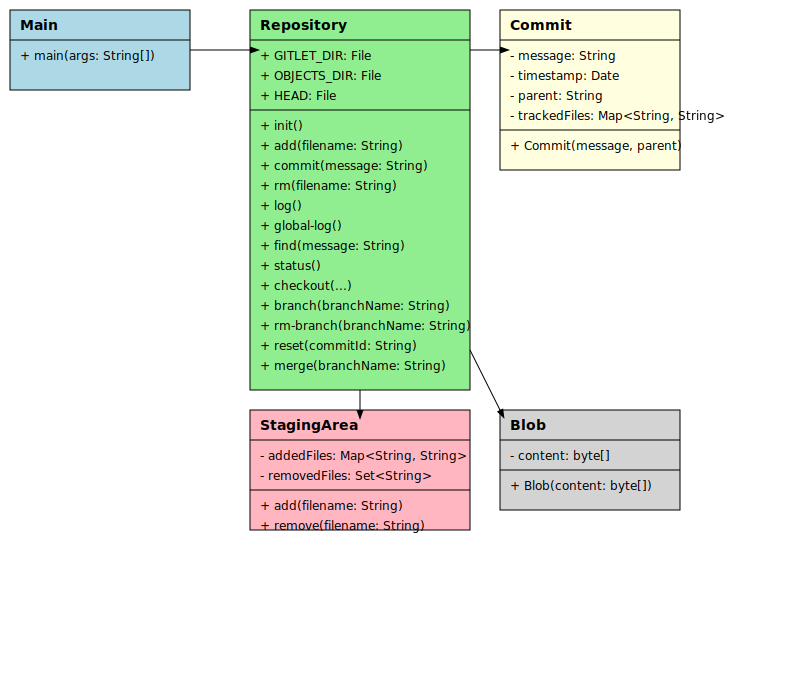

# Gitlet:  A Version Control System

## Project Overview

Gitlet is a lightweight version control system that mimics some of the basic features of Git. This project demonstrates my ability to design and implement a complex system from the ground up, showcasing my skills in Java programming, data structures, algorithms, and software design.

## Key Features

- **Init**: Initialize a new Gitlet version-control system
- **Add**: Stage files for commit
- **Commit**: Save a snapshot of tracked files
- **Log**: Display commit history
- **Checkout**: Restore a version of a file or entire commit
- **Branch**: Create, delete, and manage branches
- **Merge**: Combine changes from different branches

## System Architecture

Below is a UML class diagram that illustrates the core structure of the Gitlet system:

This diagram showcases the main components of the system:

1. **Main**: The entry point of the application, responsible for parsing command-line arguments and invoking the appropriate Repository methods.

2. **Repository**: The core class that implements all Gitlet commands. It manages the .gitlet directory structure and orchestrates operations between commits, blobs, and the staging area.

3. **Commit**: Represents a commit in the version control system, storing metadata such as the commit message, timestamp, parent commit(s), and tracked files.

4. **StagingArea**: Manages the staging and unstaging of files before a commit.

5. **Blob**: Represents the content of a file in a specific version.

## Technical Highlights

1. **Persistent Data Structures**: Implemented a custom serialization system to efficiently store and retrieve commits, blobs, and metadata.

2. **SHA-1 Hashing**: Used cryptographic hash functions to generate unique identifiers for commits and blobs, ensuring data integrity and enabling content-addressable storage.

3. **Graph Algorithms**: Implemented depth-first search and lowest common ancestor algorithms to handle branch management and merging.

4. **Memory Efficiency**: Designed a system that minimizes memory usage by storing only changes between commits, rather than full copies of files.

5. **Command Pattern**: Utilized the command pattern to implement various Gitlet operations, demonstrating my understanding of design patterns and extensible software architecture.

6. **Error Handling**: Implemented robust error checking and informative error messages throughout the system.

## Skills Demonstrated

- Strong understanding of object-oriented programming principles
- Proficiency in Java and its standard libraries
- Experience with file I/O and serialization
- Ability to implement complex algorithms and data structures
- Attention to detail in following a detailed specification
- Test-driven development practices
- Clear code organization and documentation

## Challenges and Solutions

## Challenges and Solutions

One of the main challenges in this project was implementing the merge functionality. This required careful consideration of various edge cases and potential conflicts. I solved this by:

1. Implementing an algorithm to find the lowest common ancestor (split point) of two branches
2. Developing a strategy to compare file states between the split point and both branch heads
3. Creating a clear conflict resolution process for files modified in both branches
4. Ensuring that the merge operation is atomic - either completing fully or not at all

This experience enhanced my problem-solving skills and ability to handle complex operations in a large-scale system. It also deepened my understanding of how version control systems manage diverging changes.

## Reflection

This project significantly improved my understanding of version control systems and reinforced my software engineering skills. It challenged me to think critically about system design, efficiency, and user experience.
